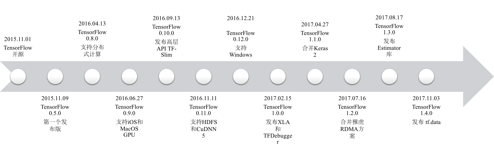

## 1.1 TensorFlow简介

当今人工智能领域最受欢迎的深度学习和机器学习框架非Google开源的TensorFlow莫属。本节将依次介绍TensorFlow的产生背景、独特价值和版本变迁，并横向对比目前主流机器学习和深度学习框架各自的特点和优劣。

### 1.1.1 TensorFlow产生背景

随着近年来深度学习模型在图像、视觉和语音领域取得不断突破，相关研究热潮持续高涨，开源深度学习框架出现百花齐放之势。其中具有代表性的框架包括XGBoost、Theano、Torch、Caffe和MXNet等。它们有的计算速度快，有的可移植性好，有的内存占用少，有的易于上手。在Google推出TensorFlow之前，大家仍处于“你方唱罢我登场”的百家争鸣状态。然而，Google推出深度学习框架TensorFlow之后，江湖巨变。

2015年10月，Google旗下的DeepMind公司研发的AlphaGo击败樊麾，成为第一个无需让子即可在19路棋盘上击败围棋职业选手的电脑程序。这一壮举不仅打破了人工智能无法在围棋领域战胜人类顶尖棋手的诅咒，而且吸引了全球各界对人工智能研究的高度关注。2016年1月，AlphaGo的研究成果发表在知名学术期刊《自然》上，这一事件也将人工智能热潮推向了新的高度。2017年5月，强化后的AlphaGo与当世第一棋手柯洁对弈，获得3:0全胜战绩。这再一次笃定了人们对于Google在人工智能领域遥遥领先的信念。

AlphaGo的后期版本使用了基于TensorFlow编写的算法模型。但事实上，AlphaGo只是让TensorFlow走进公众视野的一个契机，TensorFlow的原始动机则是Google在高速发展的信息化应用背景下，发展感知、预测等人工智能技术的需求。移动互联网、物联网、共享经济、增强实现……这些热词的背后无一不需要海量数据与智能处理能力的支撑。Google作为行业的引领者，公司内部很早便有自研的机器学习平台。TensorFlow是既有平台的多年技术积累在新的时代背景下褪变升华的成果。

TensorFlow推出后短短一个月，就成为了机器学习和深度学习项目中最受欢迎的开源框架。究其原因，离不开Google在人工智能与数据处理领域的深厚积淀及其在业界的强大号召力。同时，Google已经成功领导多个开源项目，典型的有移动操作系统Android、容器编排引擎Kubernetes、编程语言Go等，它们充分体现了Google的工程水准与协作精神。因此，在内因与外因的合力之下，TensorFlow的横空出世也就不难理解了。

### 1.1.2 TensorFlow独特价值

TensorFlow能够在众多开源框架中杀出重围，除了Google的背书以外，一定有其自身的独特价值。下面重点介绍TensorFlow相比其他开源框架的亮点和优势。

运算性能强劲：在构建和部署机器学习系统时，性能是至关重要的。TensorFlow 1.0加入的线性代数编译器XLA全方位地提升了计算性能。XLA可以帮助TensorFlow在CPU、GPU、TPU、嵌入式设备等平台上更快速地运行机器学习模型的训练与推理任务。同时，TensorFlow提供了大量针对不同软硬件环境的优化配置参数。用户可以根据自身的需求和应用的特点，进一步提升计算性能。

框架设计通用：TensorFlow不是一个严格的神经网络库。TensorFlow最初由Google Brain小组（隶属于Google机器智能研究机构）的研究员和工程师们开发出来，用于机器学习和深度神经网络方面的研究，但其灵活的设计也可广泛用于其他计算领域。同时，TensorFlow既提供高层封装API（如Slim、Keras、TF Layers等），能够帮助用户快速实现算法原型；又提供底层原生API，可以实现更灵活且高效的分布式并行模式。

支持生产环境部署：TensorFlow支持使用同一套API实现探索环境和生产环境的部署。曾经，科研人员想要将算法原型推广到生产环境中使用是一个非常痛苦的过程，因为这涉及到大量的模型重写和脚本适配工作。现在，使用TensorFlow的算法研发人员可以快速地将想法和原型运用到生产环境的产品中，也可以在学术圈更方便地分享自己的研究成果。

语言接口丰富：TensorFlow核心层由C++实现，应用层使用SWIG等技术封装，提供了多语言API的支持。目前官方支持的语言有Python、C、C++、Java、Go等。除此之外，TensorFlow的社区贡献者们也提供了非官方的应用层API，如NodeJS（<https://github.com/node-tensorflow/node-tensorflow>）、Julia（<https://github.com/malmaud/TensorFlow.jl>）、R（<https://github.com/rstudio/tensorflow>）。

端云协同计算：TensorFlow同时支持在云侧（服务器端）和端侧（移动设备等终端）运行，有效结合了云侧和端侧的各自优势。在云侧方面，TensorFlow提供多种并行模式和编译优化等技术，尽可能提升算法模型的运算性能；在端侧方面，TensorFlow提供轻量级部署和8比特压缩等技术，尽可能提升计算和存储资源利用效率。

除以上列举的优势外，TensorFlow丰富的算子库和教学资料也是其独有的竞争优势。同时，TensorFlow社区的活跃度遥遥领先其他竞争者，每个月都会有上万行的代码合入主分支。这就使得TensorFlow的新特性能够被快速实现，bug也能被快速修复。我们相信在业界众多人工智能开发者和Google工程师的共同努力下，TensorFlow能够计算得越来越快、发展得越来越好。

### 1.1.3 TensorFlow版本变迁

TensorFlow自2015年11月开源以来，已经发布了30多个版本。本小节从TensorFlow的发展历程入手，考察其关键特性的发布和对应版本的变迁。图1-1展示了这一变化过程。

图1.1  TensorFlow关键特性发布和对应版本变迁

在TensorFlow开源后第9天，Google带来了第一个正式发布版——TensorFlow 0.5.0，不过该版本仅支持在Linux系统上运行单机模型。随着TensorFlow贡献者和用户们对分布式的呼声越来越高，2016年4月发布的TensorFlow 0.8.0开始初步支持分布式计算。两个月后，TensorFlow 0.9.0增加了对多平台的支持。自此，用户可以将TensorFlow部署在Android、iOS和树莓派（Raspberry Pi）。同时，该版本还支持在macOS上使用GPU运行算法模型。

2016年9月，0.10.0版本的发布解决了TensorFlow学习成本高和上手难的问题。尤其对于非计算机背景的算法研究人员，使用该版本提供的高层API——TF-Slim能够快速实现图像和视觉领域的算法模型。TF-Slim的发布有效扩大了TensorFlow用户群体，使得高校和科研院所的研究者们也能够享受TensorFlow带来的便利。

随着TensorFlow开源一周年而到来的0.11.0版本新增了对HDFS和cuDNN 5的支持。HDFS作为Hadoop生态中的分布式文件系统，广泛地应用于大数据系统，这一特性标志着大数据生态和TensorFlow开始相互合作和共赢发展；cuDNN是NVIDIA公司开发的深度神经网络库，cuDNN 5能够进一步提升神经网络任务在GPU硬件上的计算速度。紧接着发布的TensorFlow 0.12.0开始为Windows平台提供支持，同时提供了实验性的Go语言应用层API。

2017年2月，Google在山景城（Mountain View）召开了TensorFlow Dev Summit 2017大会。大会全面地介绍了TensorFlow的进展和取得的成就，并于隔天发布了TensorFlow 1.0.0。这也成为了TensorFlow发展的一个重大里程碑事件，标志着TensorFlow已经初步成熟并能够支持生产环境部署。事实上，当时京东、小米、Uber等国内外公司也确实在生产环境中使用了TensorFlow。作为TensorFlow的第一个正式版，TensorFlow 1.0.0带来了诸多提升性能和易用性的关键特性，比如：线性代数编译器XLA，部分解决了内存消耗大和计算速度慢的问题；命令行调测工具TensorFlow Debugger，初步解决了算法模型调测困难的问题。同时，该版本还新增了对Android的友好支持，使得用户能够更快速地将TensorFlow编写的模型部署到移动设备上运行。

2017年4月，TensorFlow 1.1.0将Keras 2合并到了项目主分支的`tf.contrib.keras`目录中。从此以后，用户再也不需要独立安装Keras软件包，TensorFlow将自带Keras API。Keras是一套类似于TF-Slim的高层API，它良好的封装性和对模型的高度抽象使之收获了一大批算法开发者。但是，Keras并不等于TensorFlow，诸如分布式运行和更灵活的计算模式还得使用TensorFlow原生API实现。同时，该版本还支持用户在Windows上使用Java语言的应用层API。

2017年7月，TensorFlow 1.2.0正式合入了Yahoo!提供的基于InfiniBand等高性能网络的RDMA通信方案。早在TensorFlow白皮书中，Google就表示TensorFlow支持RDMA。但可能出于商业考虑或其他原因，一直没有将RDMA方案发布到TensorFlow开源版本中。直到TensorFlow 1.2.0发布，用户终于可以在高性能网络设备上享受RDMA带来的效率提升。这有效解决了分布式训练大模型时的通信瓶颈问题。经测试，在VGG等大模型的分布式训练场景下，RDMA相比TCP/IP能够减少一半左右的网络通信开销。

2017年8月，TensorFlow 1.3.0发布。它允许用户使用新增的Estimator库，以开箱即用方式快速实现深度神经网络分类器（DNNClassifier）、深度神经网络回归器（DNNRegressor）、线性分类器（LinearClassifier），以及深度神经网络和线性混合分类器（DNNLinearCombinedClassifier）。同时，从TensorFlow 1.3.0开始的所有二进制发布包都默认使用cuDNN 6，这将进一步提升TensorFlow在GPU上的运算性能。

2017年11月，TensorFlow 1.4.0发布。该版本新增了tf.data模块，为数据读入和处理提供了便捷高效的解决方案。该版本还增强了Estimator的能力，使其能够支持简单的分布式模型训练和评估。同时，Google还开源了GANEstimator库，以回应越来越多的用户对生成对抗网络（GAN）的需求。

回望TensorFlow的发展历程，我们不难发现Google在TensorFlow项目的推进上投入了不小的资源。在TensorFlow项目组成员和贡献者的共同努力下，TensorFlow正一步步走向成熟。

### 1.1.4 TensorFlow与其他主流深度学习框架的对比

放眼全球，诸如Google、Facebook、Amazon和Microsoft等国际巨头均在深度学习领域着手布局。一时间，江湖风云四起，各大门派争相斗法。Google坐拥TensorFlow，捍卫江湖地位；Facebook携手Caffe2和PyTorch，以图三分天下；Amazon拥抱MXNet，不甘落于人后；Microsoft坚守Cognitive Toolkit（CNTK），寻求单点突破。除此之外，还有Caffe、Torch7、Theano等老一辈深度学习框架参与竞争。可谓是乱花渐欲迷人眼，用户不知如何选。本小节将为用户客观分析各大主流深度学习框架的特点与优劣。

下面我们从社区活跃度、多语言支持、教学资源、运算性能等多个维度全方位对比主流的深度学习框架。考虑到Keras的广大用户基础，我们也将其单独列出来进行比较。表1-1对比了2017年12月各个深度学习框架在GitHub上的统计数据。不难发现，TensorFlow在各项指标中均遥遥领先。排名第二的Keras由于接口简单易用而受到广泛关注，目前Keras官方已经支持使用TensorFlow、Theano和CNTK作为后端计算引擎。紧随其后的是老牌深度学习框架Caffe，其创始人是加州大学伯克利分校的贾扬清博士，他同时也参与了TensorFlow项目的早期设计和实现。

表1-1 主流深度学习框架在GitHub的上统计数据

| 框架名称       | 所属机构       | 多语言支持                | Star数量 | Fork数量 | 贡献者数量 |
| ---------- | ---------- | -------------------- | ------ | ------ | ----- |
| TensorFlow | Google     | Python/C/C++/Java/Go | 84132  | 41072  | 1226  |
| Keras      | keras-team | Python               | 23530  | 8582   | 590   |
| Caffe      | BVLC       | C++/Python           | 22024  | 13509  | 253   |
| CNTK       | 微软         | C++                  | 13488  | 3522   | 158   |
| MXNet      | 亚马逊        | Python/C++/R         | 12594  | 4641   | 465   |
| PyTorch    | Facebook   | Python               | 10737  | 2225   | 375   |
| Torch7     | Facebook   | Lua                  | 7575   | 2222   | 133   |
| Theano     | 蒙特利尔大学     | Python               | 7515   | 2370   | 326   |
| Caffe2     | Facebook   | C++/Python           | 6665   | 1510   | 140   |

从目前局势来看，TensorFlow是最受欢迎的深度学习框架。那么，抛开Google在行业的巨大影响力，TensorFlow自身的硬实力如何呢？我们参考了多种公开基准测评，以及我们在图像和视觉领域实际测试得到的数据，给出了表1-2这组相对客观的横向对比。表中各评价指标均为5分制。因为部分框架未能找到测试数据，所以表中仅列出了指标相对确定的深度学习框架。

表1-2  主流深度学习框架在各个维度的横向对比

| 框架名称       | 教学资源 | 多语言接口 | 模型设计 | 运算性能 | 易用性  |
| ---------- | ---- | ----- | ---- | ---- | ---- |
| TensorFlow | 5    | 5     | 5    | 4    | 5    |
| MXNet      | 3    | 5     | 4    | 5    | 4    |
| Caffe      | 2    | 5     | 3    | 5    | 3    |
| Theano     | 3    | 2     | 5    | 3    | 2    |
| Torch7     | 2    | 2     | 5    | 3    | 3    |
| CNTK       | 2    | 2     | 2    | 5    | 3    |

对于深度学习框架的初学者来说，教学资源是一个非常重要的参考指标。借助Google的强大影响力和执行力，TensorFlow在这方面具有显著优势。不论是基础的指导手册，亦或是花样百出的最佳实践，初学者都有大量资料可以查询。同时，人工智能相关的会议和期刊论文中发布的新模型和新算法，几乎都会有人第一时间使用TensorFlow实现，并在GitHub上开源出来。

从多语言接口的角度来看，TensorFlow和MXNet共同占据领先地位。几乎所有框架都支持深度学习领域的“英语”——Python。TensorFlow对更多不同编程范式语言的支持使之对于不同背景的用户都具有一定的友好性，同时也扩展了框架潜在的应用领域。

从模型设计维度来看，TensorFlow采用了当前主流的基于数据流图的模型设计方式。其算子种类丰富，粒度较细，为用户提供的自由度高。相比于Caffe的配置式模型设计，TensorFlow显得更加灵活，能够适应更多的应用场景。同样使用数据流图定义模型的还有MXNet。不过，MXNet的分布式模型的约束较多，灵活性不足。

自TensorFlow发布以来，运算性能似乎一直是其弱项。GitHub和Stack Overflow上的讨论帖中也时常能够看到有人对TensorFlow的内存消耗和计算速度表示遗憾。但是，随着XLA和RDMA等特性的发布，TensorFlow的性能在绝大多数情况下都不输于其他深度学习框架。如果用户能够深入了解TensorFlow的API，那么就会发现它提供了大量提升性能的配置项。在启用这些性能优化选项后，TensorFlow的运算性能甚至能够超过MXNet和Caffe。

TensorFlow的灵活性是它的一大优势，但同时也因为API过于丰富而带来了学习成本高的问题。尤其是对于仅研究算法和模型的开发人员，在没有时间全面了解TensorFlow运行机制和编程接口的前提下，往往觉得无从下手。针对这类用户，社区的开发者们也提出了不少解决方案，那就是以Keras、TF Layers和TF Learn等为代表的高层API封装库。这些库隐藏了TensorFlow的大量细粒度接口，以简单易懂的接口取而代之，使得读者能够快速上手编程，并实现一些单机运行的算法模型。

综合对比当前主流的深度学习框架，TensorFlow在各个维度都具有比较明显的优势。同时，TensorFlow社区的活跃度也远超其他社区。这会使得越来越多的深度学习从业者参与贡献TensorFlow项目，最终形成越用越好用的良性循环。

#

**Prev：**[第1章 TensorFlow系统概述](1.0_overview.md)

**Next：**[1.2 TensorFlow的设计目标](1.2_objectives.md)