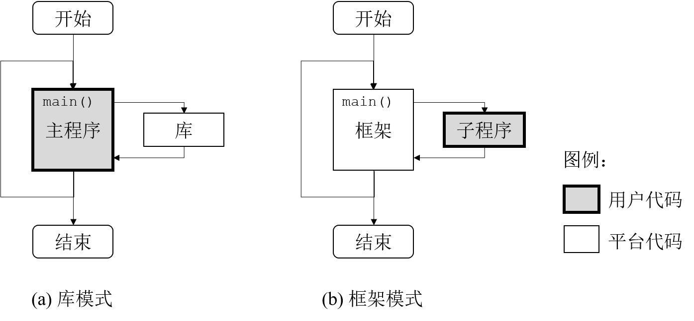
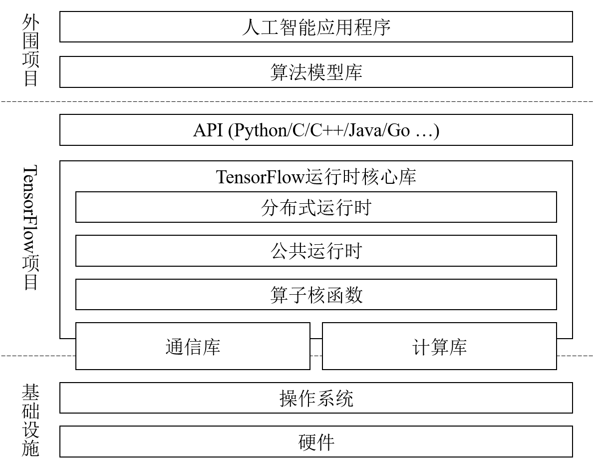

## 1.3 TensorFlow的基本架构

在展开介绍TensorFlow的使用方法和设计原理之前，我们有必要建立对TensorFlow基本架构的直观认识。本节从工作形态和组件结构两个角度对TensorFlow进行概要性的说明。读者可以以此为切入点，逐步理顺学习TensorFlow的脉络。

### 1.3.1 TensorFlow的工作形态

基础平台层软件的设计模式多种多样，它们对应用层开发者体现出的工作形态也有所差别。在众多平台设计模式中，存在两类基础而典型的模式，即图1-2所示的库模式和框架模式。在库模式下，平台层软件以静态或动态的开发库（如.a、.so文件）形式存在，应用层开发者需要编写程序调用这些库提供的函数，实现计算逻辑。程序的入口（如main函数）及整体流程控制权把握在应用层开发者手中。在框架模式下，平台层软件以可执行文件形式存在，并以前端交互式程序或后端守护进程方式独立运行。应用层开发者需要遵从平台规定的接口约束，开发包含计算逻辑在内的子程序，交由框架性质的平台层软件调度执行。程序的入口及整体流程控制权由框架把握。

图1-2  平台层软件的典型设计模式

在高性能与大数据计算领域，典型的库模式软件有用于计算的Eigen、NumPy，以及用于通信的MPI、ZeroMQ等。基于这些库开发应用时，编程方式比较灵活，部署模式也相对轻量。应用开发者具有较大的自由度，但不得不编写业务逻辑之外的不少“脚手架”代码，以便将算法代码片段转变为完整可用的软件。典型的框架模式软件有大数据计算平台Hadoop、Spark，以及基于SQL和类SQL语言的数据库、数据仓库等。使用这些框架开发应用时，开发者的工作相对轻松，只需要编写与业务逻辑密切相关的算法代码，不用关心运行时机制的复杂性。不过，程序的灵活性将受制于框架的约束。

TensorFlow的设计采用了库模式。之所以如此，是出于灵活通用、端云结合及高性能等设计目标的考虑。库模式的平台层软件便于与各种既有的框架协同工作，不对软件的运行时组件添加新的约束，应用范围也不受制约。除了依赖最基本的编程语言库和操作系统调用，这类平台层软件同其他环境因素解耦，从而可以做到高度的可移植性。在单机和终端等场景下，由于没有守护进程和调度框架的开销，有效计算逻辑的资源利用率也会提高，进而有助于性能优化。

综上，TensorFlow的工作形态是由用户编写主程序代码，调用Python或其他语言函数库提供的接口以实现计算逻辑。用户部署和使用TensorFlow系统时，不需要启动专门的守护进程，也不需要调用特殊的启动工具，只需要像编写普通的本地应用程序那样即可上手。用户也不用担心库模式的开发所必须的那些“脚手架”代码，因为TensorFlow已经提供了多种高级抽象，尽可能地最小化了核心计算逻辑之外的开发工作。

### 1.3.2 TensorFlow的组件结构

TensorFlow作为一套包含数十万行代码的大型软件，其组件结构较为复杂。不过，由于其代码组织合理，文档资料充分，我们很容易将它的软件结构进行不同抽象程度的宏观呈现。初识TensorFlow的新手只需要从最高层的抽象视角观察其组件构成。图1-3给出了一幅粗粒度的TensorFlow组件结构示意图，展示了TensorFlow的主要内部结构及其与周边环境的关系。

图1-3  TensorFlow的组件结构示意图

构成TensorFlow的主体是其运行时核心库。对于普通的Python应用层开发者而言，这个核心库就是指通过pip命令等方式安装TensorFlow之后，部署到site-packages或类似目录中的动态链接库文件。生成这个库的C++源代码大致分为3个层次：分布式运行时、公共运行时和算子核函数。其中，公共运行时实现了数据流图计算的基本逻辑，分布式运行时在此基础上实现了数据流图的跨进程协同计算逻辑，算子核函数则包含图上具体操作节点的算法实现代码。

TensorFlow运行时核心库导出的函数接口基于C和C++语言。为了使用其他语言进行应用开发，TensorFlow提供了多语言的API层。Python应用层开发者在代码中调用“`import tensorflow as tf`”时，导入的便是TensorFlow安装在Python第三方库目录下的API层模块（本书后文沿用这种Python包导入惯例，使用“tf”作为“tensorflow”命名空间的缩写）。API层对用户屏蔽了TensorFlow核心库的动态链接逻辑，使得用户可以使用自己熟悉的语言编写算法模型。

为了简化经典模型的开发，使得TensorFlow成为一套“开箱即用”的工具，Google官方团队及开源贡献者们在TensorFlow社区开设了若干算法模型库及人工智能应用程序项目。用户可以复用这些项目的成果，加快自己的项目开发进度；也可以学习它们的实现原理，提升自己的模型与应用设计水平。这些外围项目中的部分代码（如Kares）已被认为具有较高的共性价值，因此逐步被加入到TensorFlow主项目之中。

TensorFlow运行时核心库底层对接的是各种计算库和通信库。这些库有的是外部组件（如用于CPU代数计算的Eigen库），有的则作为TensorFlow源代码的一部分集成在核心库内部（如用于GPU并行计算的StreamExecutor库）。用户在开发应用程序时看不到这些库的细节，只需要按照软件文档安装好必要的外部依赖包即可。

上面所有组件均运行在本地操作系统和硬件基础设施之上。在服务器端运行场景，最常见的宿主操作系统是Linux，硬件一般为x86 CPU和NVIDIA GPU。在移动终端运行场景，宿主操作系统可以是Android、iOS等，硬件一般为ARM CPU和专用的人工智能芯片。TensorFlow不仅支持原生的物理环境，它对虚拟机和容器也完全兼容，这构成了云计算环境下的最佳实践。

#

**Prev：**[1.2 TensorFlow的设计目标](1.2_objectives.md)

**Next：**[1.4 小结](1.4_conclusion.md)

